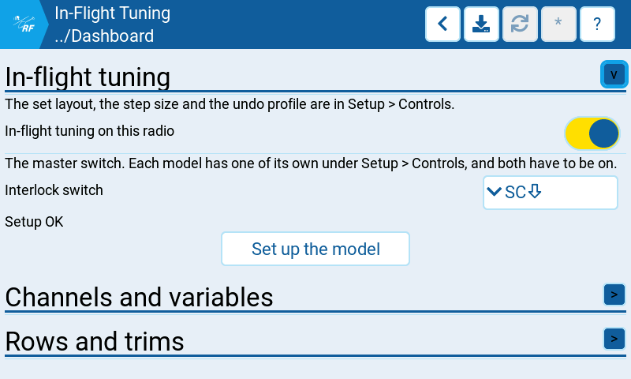
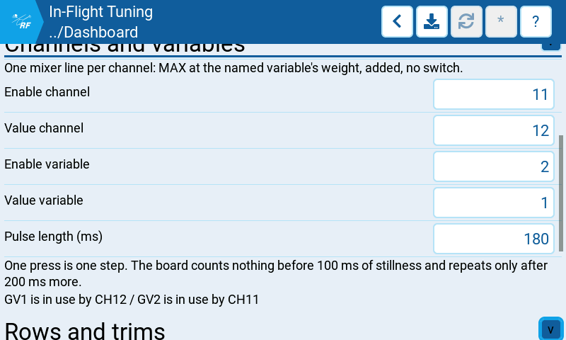
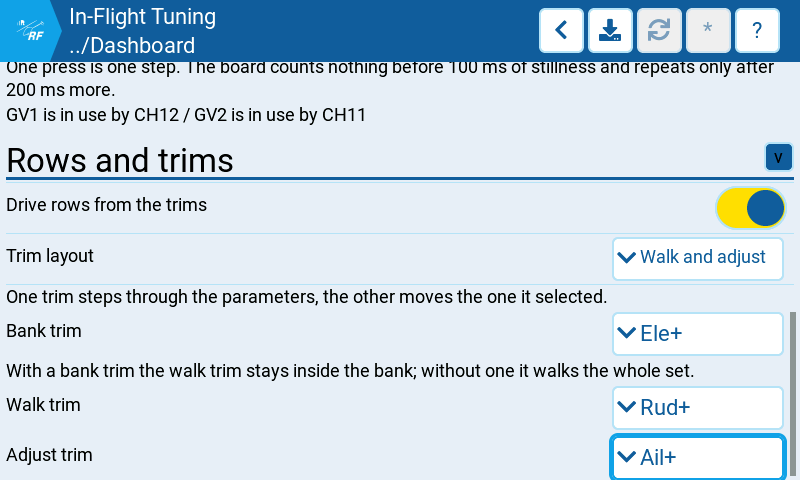

# In-Flight Tuning

The radio's half of the in-flight tuning overlay: which switch brings the surface up, which
channels and global variables carry it, and which trims move it. These settings belong to the
radio and apply to every model on it, so no flight controller has to be connected to change
them. What describes the helicopter — the set layout, the step sizes and the undo profile —
is on the other page, *Configuration* → *Setup* → *Controls* → *In-Flight Tuning*.

What the overlay itself does in the air is in
[the dashboard guide](../../../dashboard/inflight-tuning.md).

## Where to find it

*System* → *Settings* → *Dashboard* → *In-Flight Tuning*

Hidden until *System* → *Settings* → *General* → *Preview* → *In-flight tuning* is on.

## Settings

### In-flight tuning

| Setting | What it does |
| --- | --- |
| In-flight tuning on this radio | The master switch. With it off nothing drives on any model. Each model has one of its own on the flight controller page, and both have to be on. Off by default. |
| Interlock switch | The switch that brings the surface up and makes it live. *None* by default, which leaves the overlay unreachable. |
| *(the line under it)* | What the setup check found when it last walked the model: *Setup OK*, *Setup not checked*, or the faults it names. A fault refuses the interlock, so the surface does not go live while one stands. |
| Set up the model | Writes the two mixer lines, the global variable details and the trim modes this model needs. It shows what it would remove and what it would add first, and writes nothing until that is confirmed. |

### Channels and variables

One mixer line per channel: `MAX` at the named variable's weight, added, no switch.

| Setting | What it does |
| --- | --- |
| Enable channel | The channel that says which bank the flight controller is listening on. 5 to 16, default 11. |
| Value channel | The channel that steps the parameter. 5 to 16, default 12. |
| Enable variable | The global variable put on the enable channel. 0 to 9, where 0 is none; default 6. |
| Value variable | The global variable put on the value channel. 0 to 9, where 0 is none; default 5. |
| Pulse length (ms) | How long a press holds the value channel in its window. 100 to 250 in steps of 10, default 180. One press is one step: the flight controller counts nothing before 100 ms of stillness and repeats only after 200 ms more, so the pulse has to outlast the first and end before the second. |

A variable already driven by another mixer line is named under the fields as a warning, not a
refusal: a pilot who knows what that line does may still want it.

### Rows and trims

| Setting | What it does |
| --- | --- |
| Drive rows from the trims | Whether the physical trims move the surface at all. On by default; touch works either way. |
| Trim layout | *Walk and adjust* (default) claims up to three trims — one steps the bank, one walks the row inside it, one moves the value. *One trim per row* gives each of the six rows its own trim, which is the layout the generic radio setup documents and needs six trims to spare. |
| Bank trim, Walk trim, Adjust trim | The three trims of *Walk and adjust*. Without a bank trim the walk trim walks the whole set instead of staying inside one bank. Shown in that layout only. |
| Row 1 to Row 6 | The trim belonging to each row. Shown in the *One trim per row* layout only. |

## Notes

- A trim that drives a row has to be switched off as a trim in the active flight mode, or the
  same press also moves that stick's neutral. *Set up the model* does this, and the setup
  check reports it when it has not been done.
- On an ExpressLRS link use the *Wide* switch mode or a full-resolution packet rate. In
  *Hybrid* mode the value and bank channels carry 16 and 6 positions, so several rows and two
  banks miss the windows the flight controller decodes.
- These settings are saved on the radio. The widget takes a change to them on its own clock,
  and that clock is held while the model is armed — a change made in the air arrives after
  landing.

## Related

- [In-flight tuning overlay](../../../dashboard/inflight-tuning.md) — what the surface does in
  the air.
- [Rotorflight documentation](https://www.rotorflight.org/docs/) — the flight controller's
  adjustment functions, which are what this drives.

*Documented against RFSuite 0.1.7.*
